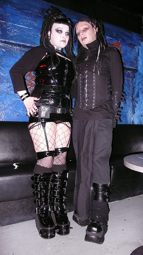
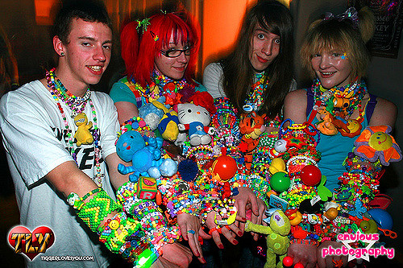

<!-- We need to use an absolute external URL for SVGs -->
# 
Writings about nightclubs and rave mechanics by an experienced dancer

## Background
I, Todd Wolfson, am a programmer by career and dancer (freeform) by hobby. I've been dancing and going to nightclubs regularly since 2009.

At the time of writing, I've been dancing on the US East Coast, US West Coast, Israel, Mexico, Japan, and the US Mid-west.

There's a lot of details that you slowly pick up over time. This is my brain dump of that information.

I should state up-front that I'm a tall white male and these experiences have been during my early to mid-20's. Your experiences/observations may vary so please read this with a grain of salt.

## Table of Contents
- [Behaviors (e.g. salmon, circles, finding space/traps)](#behaviors)
- [Undergrounds, raves, and after-hours (e.g. info lines, TBA/TBD)](#undergrounds-raves-and-after-hours)
- [Subcultures/Appearances (e.g. goth, kandi kid)](#subculturesappearances)
- [City differences (e.g. smoking, distance)](#city-differences)
- [Personal notes (e.g. photos, compliments)](#personal-notes)
- [Deep knowledge (e.g. staff, tipping)](#deep-knowledge)

## Behaviors
Over time nightclub attendees pick up social behaviors, either out of habit or observation. These are common ones that you will notice.

### Salmon
A salmon is someone who pushes past other people to get to the front of the crowd, only to immediately rush to the back with more pushing/shoving.

I know I came across this definition somewhere but have no recollection where.

I should note that you could also be standing/dancing in a through-way, which is a valid spot, but the people walking past you are not salmon. If you dance in this spot, then please move/dance out of the way so there is no blockage.

### Statue
A statue is someone who stands still on the dancefloor.

As a dancer, it's extremely frustrating since we are usually struggling to find space.

I have no idea why this behavior occurs but it does =(

### Circles
Dance circles are probably the most common occurrence you will see. These are when people clear out space and 1 or 2 persons dance in the center for a song or less.

**How they are formed:**

I have seen circles formed in 2 ways:

- Someone starts dancing really good, others start looking/moving back, and eventually there's enough padding that a circle has formed
- Someone (usually drunk) sees a good dancer and starts pushing people back/drawing attention to the dancer
    - These ones usually don't last very long

**How they work:**

People on the outside look in and watch the dancer in the center. You can dance on the outside but don't go all out; have respect for the dancer in the circle.

When the person out of the center, another dancer can replace them.

If you have already danced before, you can re-enter the circle but don't hog the circle (you will probably get tired as is).

**How they end:**

When people stop re-entering the circle, there's usually a pause. Then everyone starts dancing and the circle collapses.

### Finding space
Finding space to dance can be finnicky. There are a few things that impact dancefloor density:

- Time, usually every city as a "peak" when the club is most packed
    - The dancefloor will be less packged before/after peak
    - For example, in Chicago peak is usually from midnight to 1:30AM. However, this can vary between venues (e.g. different closing times) and definitely varies between cities
- Artist/DJ, crowds usually have a shared taste so people will go get drinks/smoke if they aren't digging a set
- Location, typically the sides and back of a dancefloor are least crowded
    - Unfortunately, these are also usually throughways so be aware and be sure to move for people passing through

Due to my height, I can usually see openings through people or with a hop/jump.

One nuance I want to mention is traps. These are almost open spaces that can be found in the middle of the dancefloor. Unfortunately, they can sometimes collapse quickly and you will be left with virtually no space.

My rule of thumb for traps is only move to them if there's at least 1.5x the amount of space that I want.

## Undergrounds, raves, and after-hours
Some parties like to be exclusive. This can be for a variety of reasons (e.g. keeping attendance low, not allowed to serve after a specific time).

I should note that these events are typically open secrets (i.e. people who need to know about these already do).

In my experience, most cities have them and the main restriction is how good you are at searching.

The mechanics of getting to the venue can feel strange at first so this is to walk you through the motions.

### Info lines
If the event says to call a number, then that number is known as an info line. It's a temporary phone number the event organizer to set up communicating the address.

When the number becomes available, call it and a recording will tell you when and where the event is.

### TBA/TBD
Some events might say TBA/TBD. This can play out in a few ways:

- Organizer updated event page slightly before event with location (or info line)
- Organizer sends event info to ticket holders
- Nothing happens
    - This scenario is rare but have a backup event if this is the first time you are using this promoter

## Subcultures/Appearances
Depending on your city and venue, you may encounter subcultures that you haven't seen before. This is not meant to be an all-encompassing list but is highlights from my experience.

### Goth
Dark clothing and dark hair. Usually found at a venue catered to this subculture.

### Kandi kids
A raver who wears plastic jewelry (aka kandi). Usually found at an event/venue catered to this subculture.

Image attribution: [images/external/sources.txt](images/external/sources.txt)

## City differences
Every city is different, here are some experiences I have gone through:

- Trains stop running after a certain hour (need to find alternative transit)
- In Japan and Mexico, people can smoke in the club
- In Japan, people arrive at 1:00-1:30AM (when the trains stop running) and stay until 5:00-6:00AM (when the trains start running)
- In Mexico, some songs make people transition into partner dancing
- In Japan, people give you space to dance (no crowding like the US)
- In some venues, the staff might not speak your language =X

## Personal notes
Since not everyone might want to be a dancer like me, I want to throw out some notes that people usually get surprised about.

- At a nightclub, I usually receive 1-2 compliments a night
    - On rare occasions, I have heard up to 5-6
- In some venues, other attendees will ask for a photo with me. I have never not obliged. I have never seen any of those photos.
    - Recently, this has happened once every 3 times I go out
    - When I was in Mexico, this happened about 4 times in a night
    - Similarly, people may start recording me

## Deep knowledge
This section is intended to cover boring material, feel free to skip it.

### People
There are a lot of moving parts in a modern nightclub:

- Inbound - People that get you into the nightclub
    - Promoters - People that post to boards and promote in-person
    - Boards/Newsletters - Physical and electronic places to receive event information
    - Artists/DJs - People that will be playing or attending the event that have a high profile
- Venue - People that help the nightclub machine move
    - Bouncer - Determine who enters as well as mitigates events within the venue
    - Entry clerk - Person who takes your entry fee
    - Coat clerk - Optional (requires coat check), person who stores your coat for a nominal fee
    - Bathroom clerk - Optional (typically depends on city), person who works the sink in the bathroom (e.g. offers soap and paper towels)
    - Performer - Optional (depends on venue), person who puts on a show for the crowd
        - This can be ongoing (e.g. dancer has a spot that they dance in for a while, then take a break, and return later)
        - Or it can be one-time (e.g. aerialist performs a set)
    - Bartender - Person serving you drinks
    - Bar-back - Person who cleans glasses and restocks bottles
        - This person has no customer/attendee interaction
        - In Mexico, I saw this broken down into people who took orders and people who made drinks. It was very efficient
    - Servers - People who serve tables
    - Attendees - People attending the nightclub

### Bartender attention and tippping
Getting a bartender's attention can be tricky. Here are some notes:

- Be close enough to the bartender that they will see you (i.e. not at opposite ends of the bar)
- Be nice to bartender since they took time to serve you, always tip even for water
    - This will also help reduce serving time in the future as they know you tip
    - Free drink guide (never tried): https://www.youtube.com/watch?v=cLNJjUuDLDM
- I usually keep my positioning with at least 1 hand on the counter
    - Ideally I'm square to the bar with both hands on the counter
    - I remember a joke video of different technique to wave money at a bartender
        - But don't wave money at the bartender, it's rude https://www.youtube.com/watch?v=Kn8w441BoTw

### Cash vs credit
Cash and credit have their own set of trade-offs. I typically prefer cash since it's simpler:

- Cash requires time upfront from bartender
- Credit card can be forgotten at the bar
- Credit card can have minimum charge
- Credit card can take long time to retrieve at last call

## Further information
### Movies
These movies should not be considered as rules/all-knowing but perspectives as what other people have experienced. Take them with a grain of salt.

- [The Boys & Girls Guide to Getting Down](http://www.imdb.com/title/tt0464907/)
    - Satirical movie that covers club life
- [Human Traffic](http://www.imdb.com/title/tt0188674/)
    - Covers club/rave scene in England in the 90's

## License
Copyright (c) 2016 and beyond Todd Wolfson

Licensed under the MIT license
