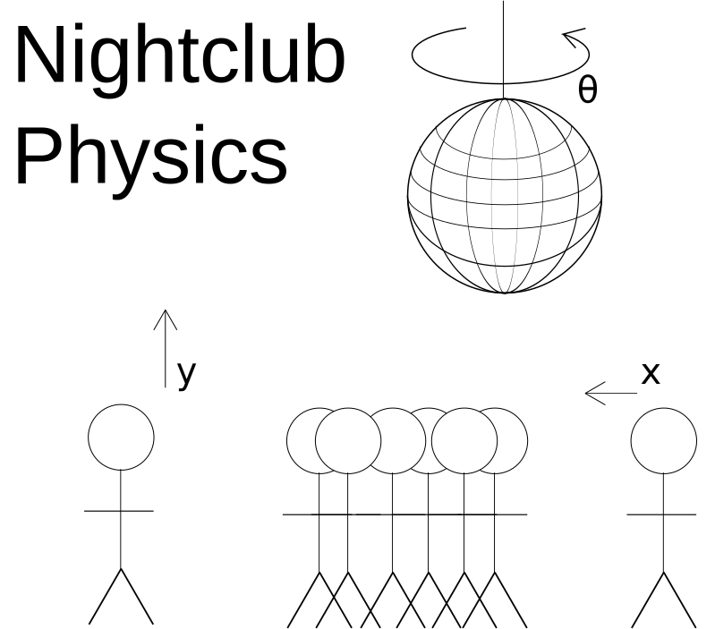

# Nightclub Physics
Writings about nightclubs and rave mechanics by an experienced dancer

## Background
I, Todd Wolfson, am a programmer by career and dancer (freeform) by hobby. I've been dancing and going to nightclubs regularly since 2009. At the time of writing, I've been dancing on the US East Coast, US West Coast, Israel, Mexico, Japan, and the US Mid-west.

There's a lot of details that you slowly pick up over time. This is my brain dump of that information.

## Topics to cover
- [ ] Appearances (e.g. goth, kandi kid)
- [ ] Behaviors (e.g. salmon, circles, traps)
- [ ] Undergrounds and you (e.g. info lines, TBA/TBD)
- [ ] City differences (e.g. smoking, distance)

## License
Copyright (c) 2016 and beyond Todd Wolfson

Licensed under the MIT license
